# Portfolio · English Slides

Vision Perception Engineer · Autonomous Industrial Forklift 3D Perception · End-to-End Deployment

## 1. Intro · Vision Model R&D

<figure markdown>
  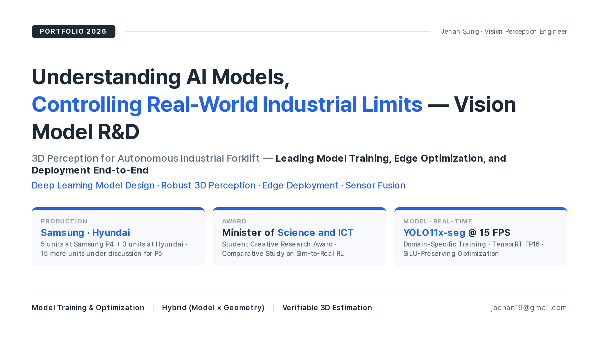{ width="100%" }
</figure>

## 2. Main Project · Industrial Deployment

<figure markdown>
  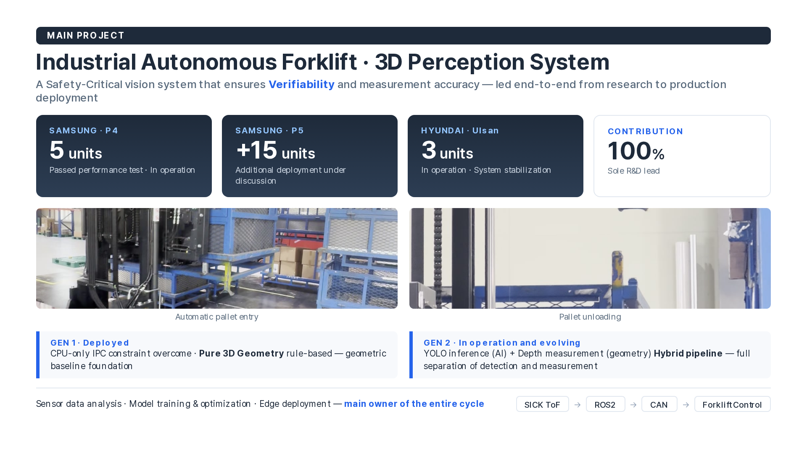{ width="100%" }
</figure>

## 3. Research Journey · Master's → Industry

<figure markdown>
  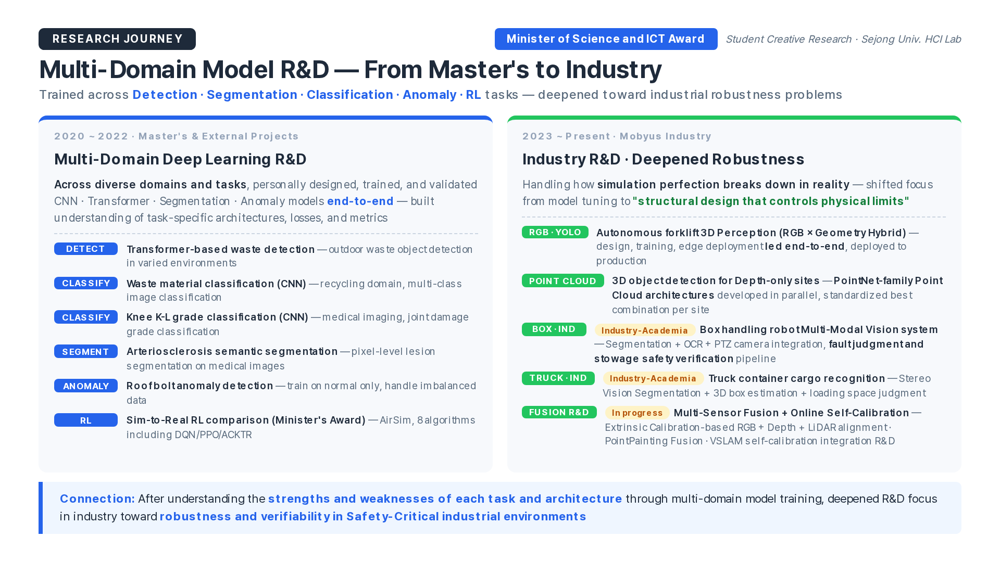{ width="100%" }
</figure>

## 4. Award · RL Autonomous Drone

<figure markdown>
  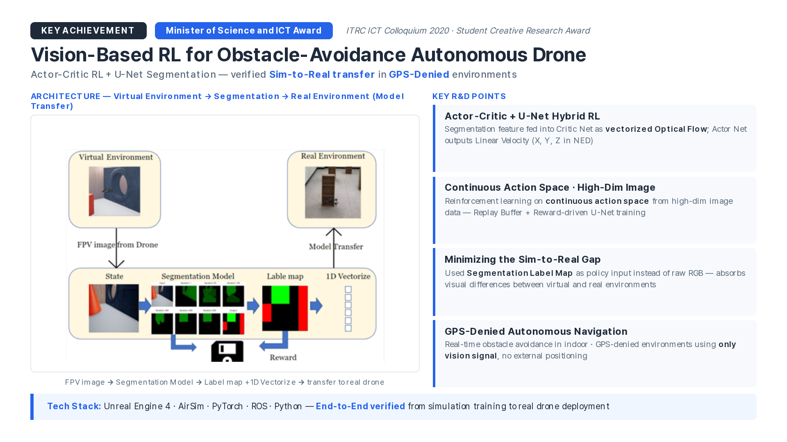{ width="100%" }
</figure>

## 5. Award Details · Sim-to-Real Transfer

<figure markdown>
  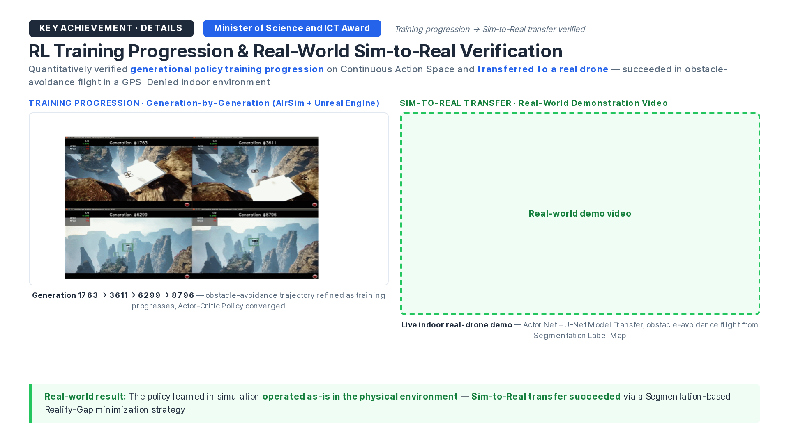{ width="100%" }
</figure>

## 6. Research Challenges · 3 Vision Problems

<figure markdown>
  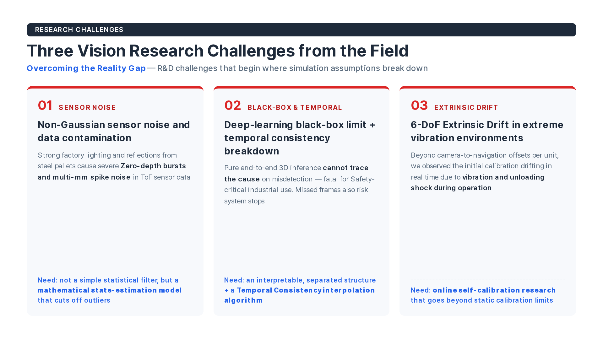{ width="100%" }
</figure>

## 7. End-to-End Vision MLOps

<figure markdown>
  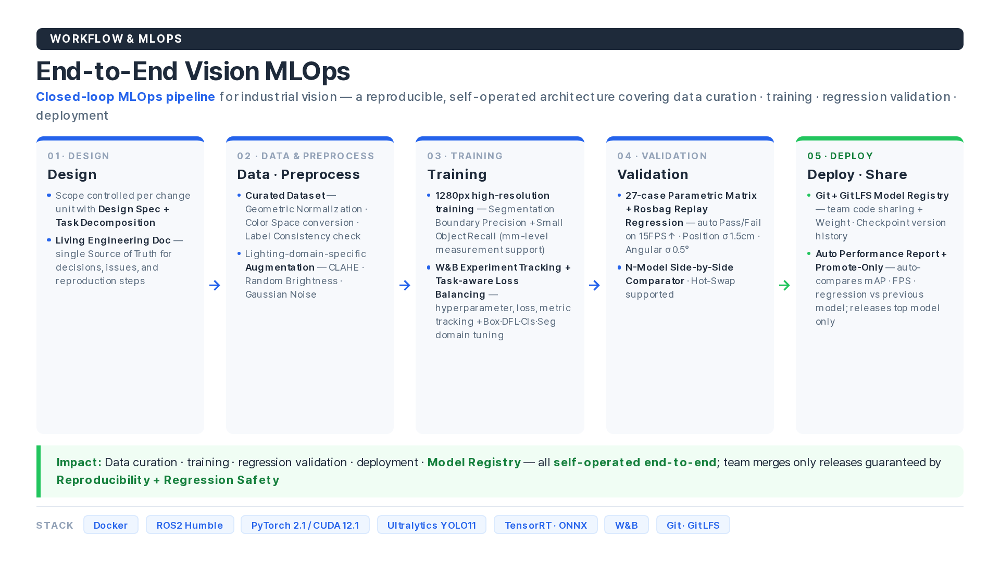{ width="100%" }
</figure>

## 8. Research Insight · Why Hybrid Architecture

<figure markdown>
  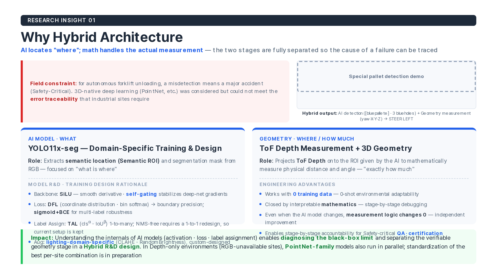{ width="100%" }
</figure>

## 9. System Foundation · Geometric Baseline (GEN 1)

<figure markdown>
  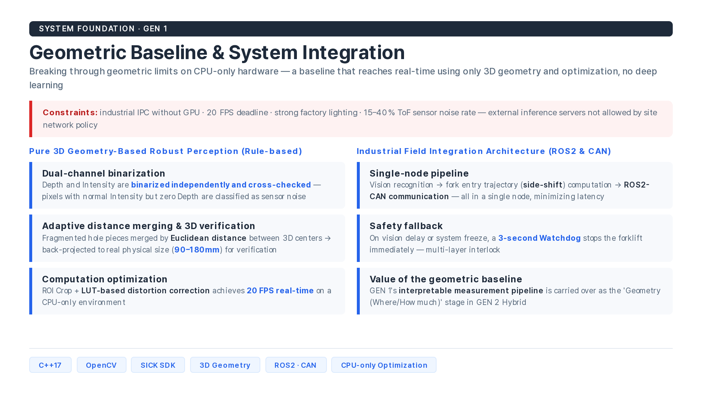{ width="100%" }
</figure>

## 10. RI-02 · Filter Separation → Temporal Consistency

<figure markdown>
  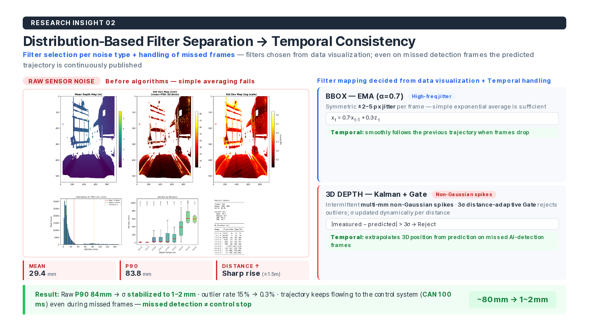{ width="100%" }
</figure>

## 11. RI-03 · Ring Sector Median

<figure markdown>
  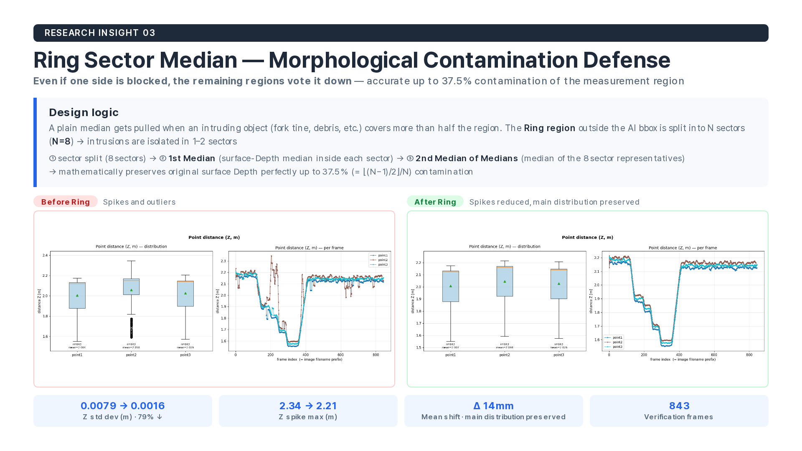{ width="100%" }
</figure>

## 12. RI-04 · Edge Optimization (SiLU-Preserving · CUDA Kernel)

<figure markdown>
  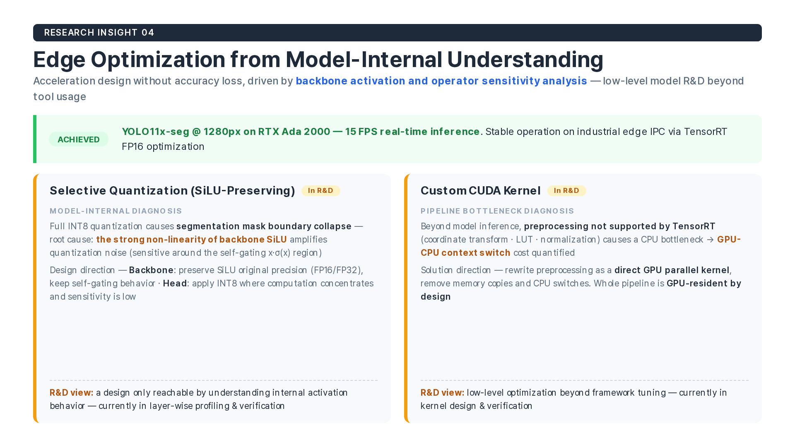{ width="100%" }
</figure>

## 13. Edge Deployment · INT8 Quantization + GPU Pipeline

<figure markdown>
  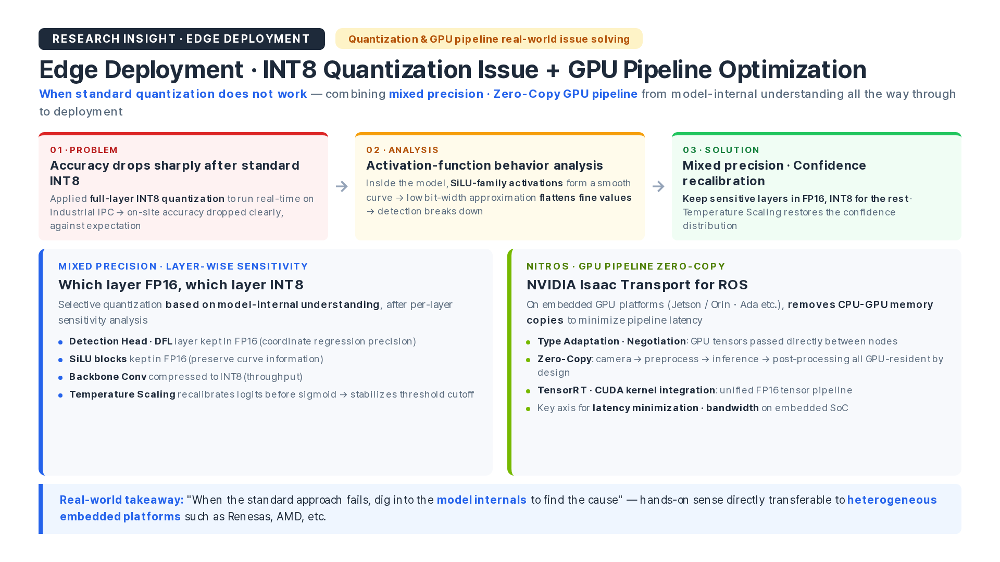{ width="100%" }
</figure>

## 14. RI-05 · 3-Layer Online Self-Calibration

<figure markdown>
  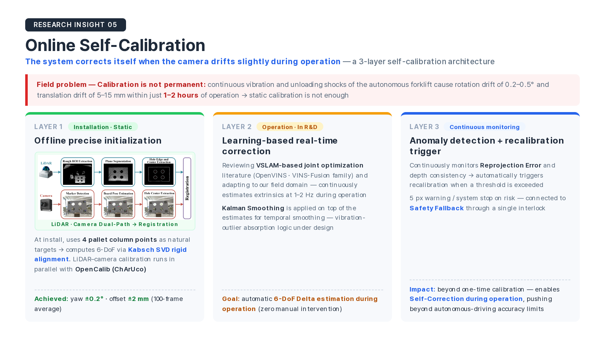{ width="100%" }
</figure>

## 15. VSLAM · LiDAR Keypoint Self-Calibration Pipeline

<figure markdown>
  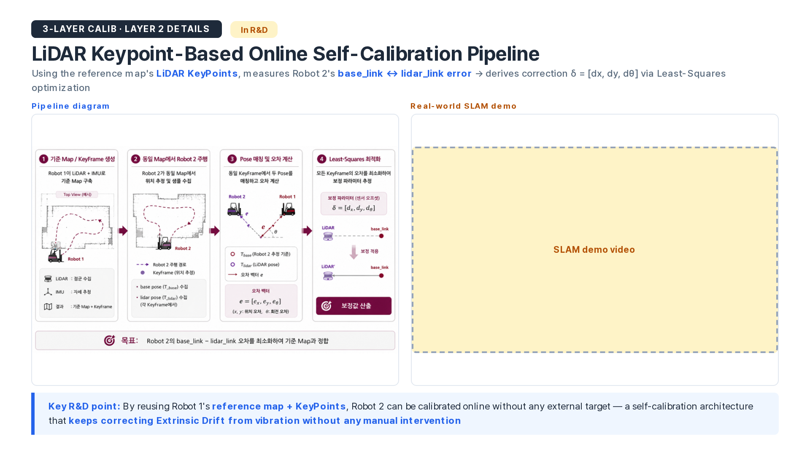{ width="100%" }
</figure>

## 16. Multi-Sensor Fusion Integration R&D

<figure markdown>
  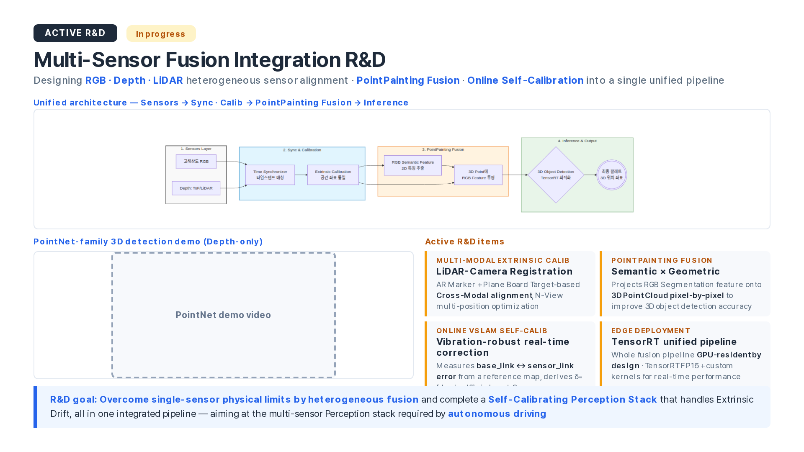{ width="100%" }
</figure>

## 17. Isaac Sim-Based Sim-to-Real R&D Roadmap

<figure markdown>
  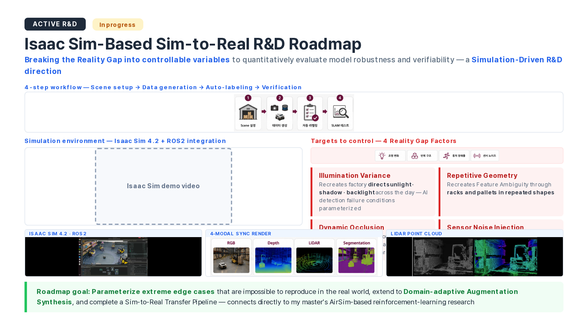{ width="100%" }
</figure>

## 18. Outro · Vision

<figure markdown>
  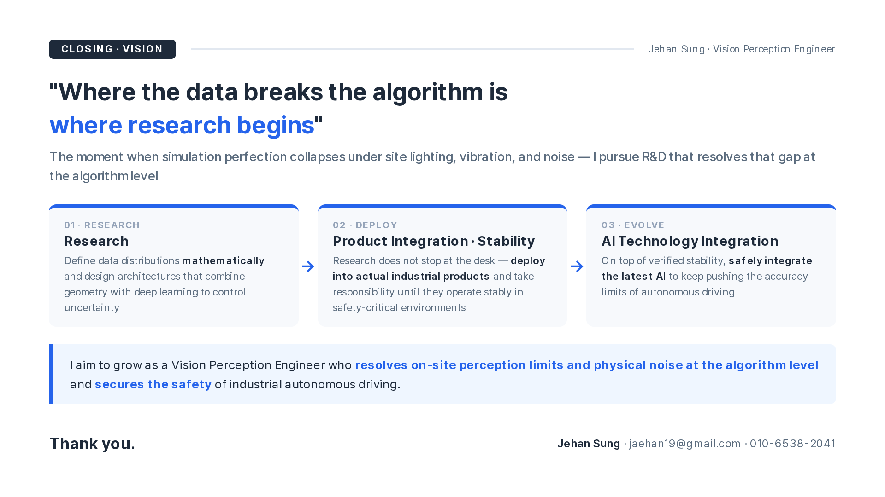{ width="100%" }
</figure>
