# 포트폴리오 · 한국어 슬라이드

Vision Perception Engineer · 자율주행 무인 지게차 3D Perception · 산업 배포까지 전 주기

## 1. Intro · Vision Model R&D

<figure markdown>
  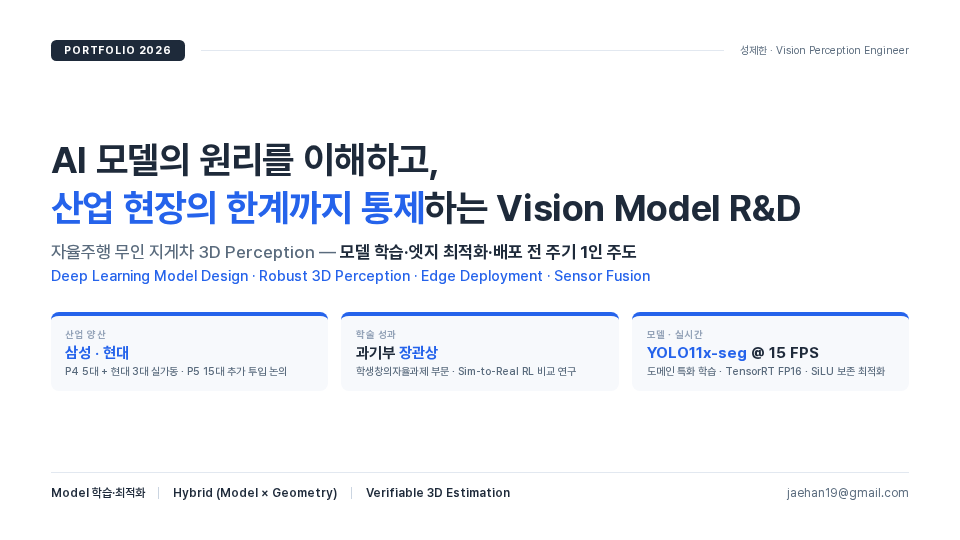{ width="100%" }
</figure>

## 2. Main Project · 산업 배포

<figure markdown>
  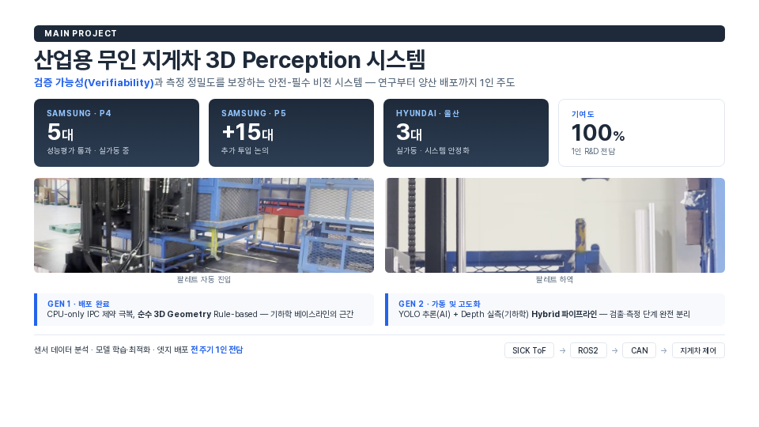{ width="100%" }
</figure>

## 3. Research Journey · 석사 → 실무

<figure markdown>
  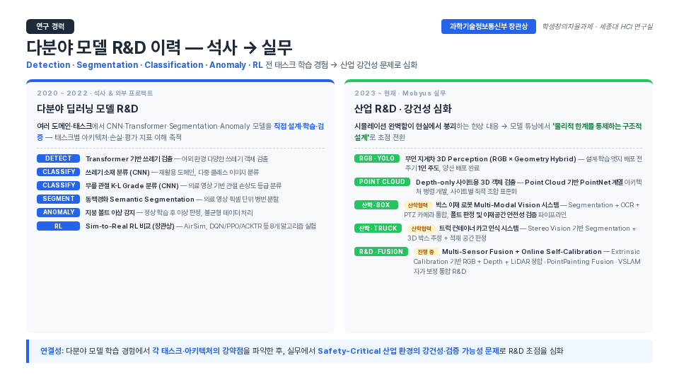{ width="100%" }
</figure>

## 4. Award · 강화학습 자율주행 드론

<figure markdown>
  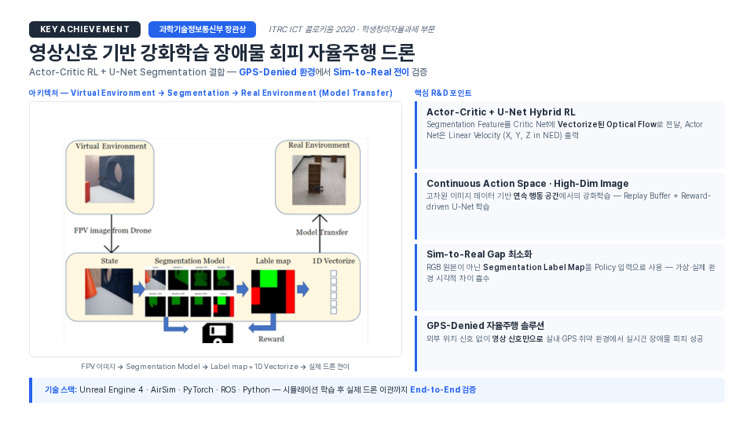{ width="100%" }
</figure>

## 5. Award 상세 · Sim-to-Real 전이 검증

<figure markdown>
  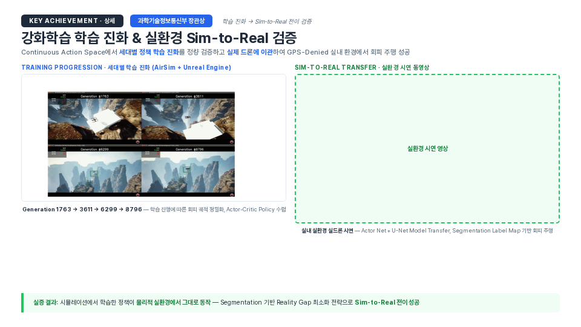{ width="100%" }
</figure>

## 6. Research Challenges · 3대 비전 연구 과제

<figure markdown>
  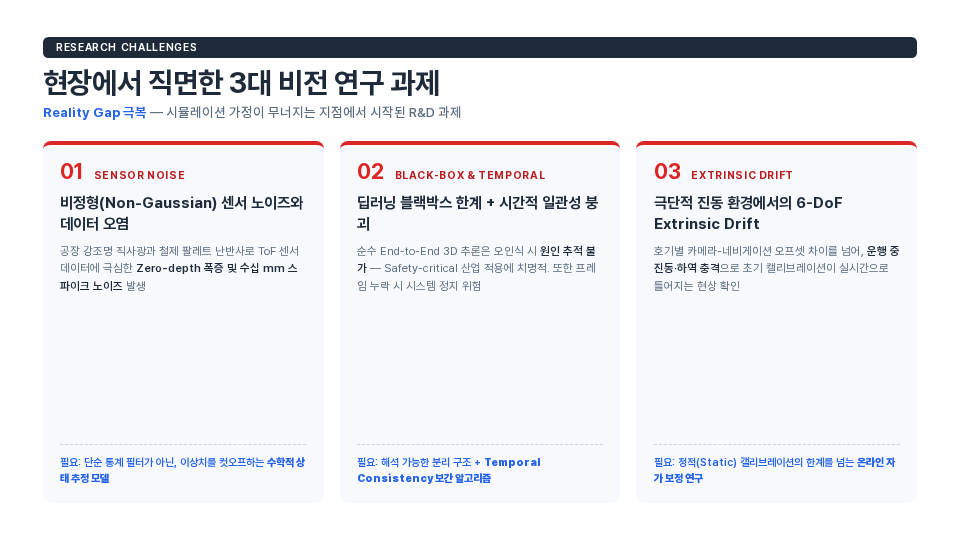{ width="100%" }
</figure>

## 7. End-to-End Vision MLOps

<figure markdown>
  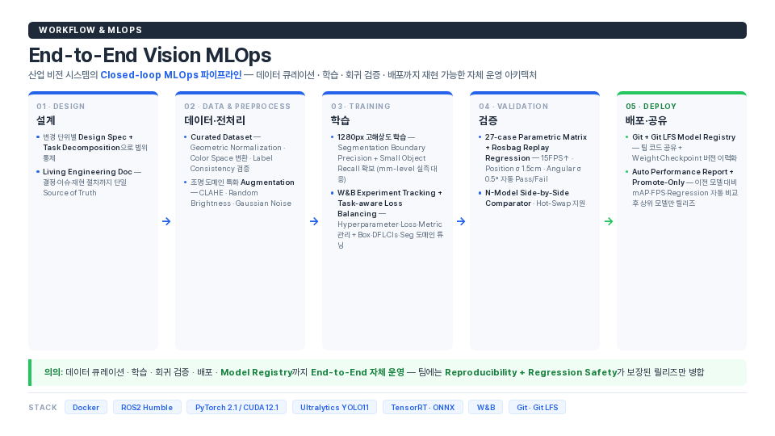{ width="100%" }
</figure>

## 8. Research Insight · Why Hybrid Architecture

<figure markdown>
  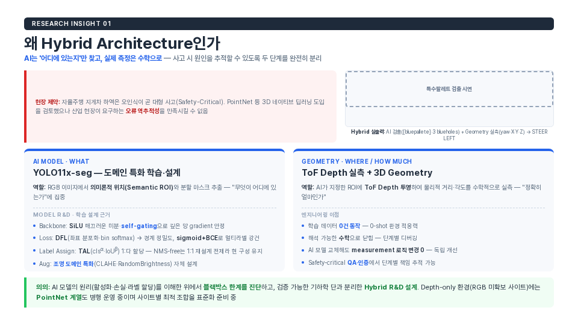{ width="100%" }
</figure>

## 9. System Foundation · 기하학 베이스라인 (GEN 1)

<figure markdown>
  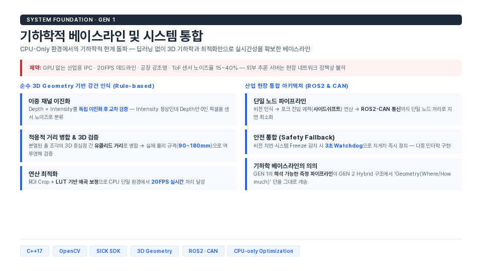{ width="100%" }
</figure>

## 10. RI-02 · 필터 분리 → Temporal Consistency

<figure markdown>
  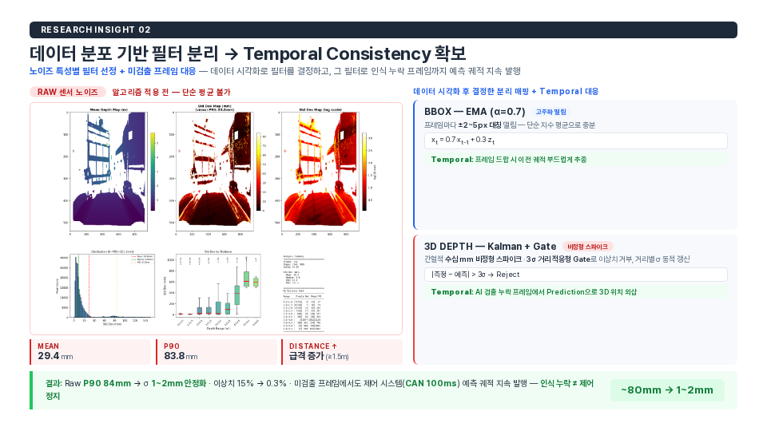{ width="100%" }
</figure>

## 11. RI-03 · Ring Sector Median

<figure markdown>
  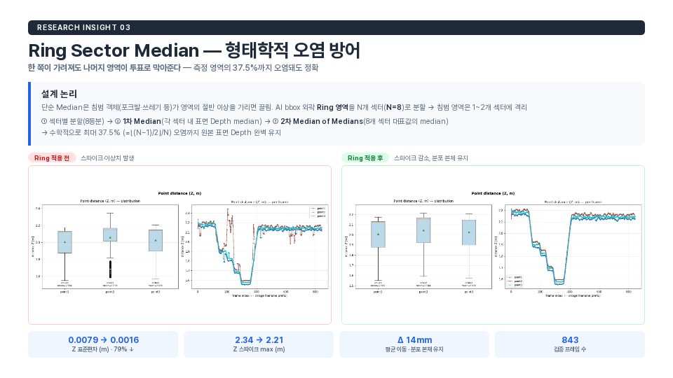{ width="100%" }
</figure>

## 12. RI-04 · 엣지 최적화 (SiLU 보존 · CUDA 커널)

<figure markdown>
  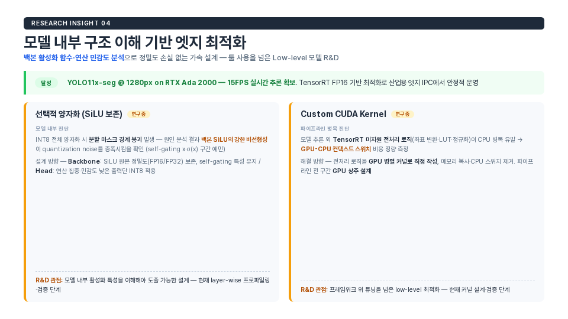{ width="100%" }
</figure>

## 13. Edge Deployment · INT8 양자화 이슈 + GPU 파이프라인

<figure markdown>
  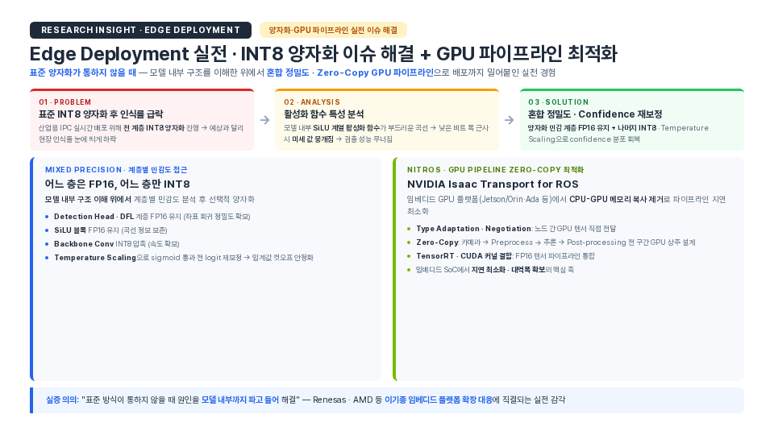{ width="100%" }
</figure>

## 14. RI-05 · 3단계 Online Self-Calibration

<figure markdown>
  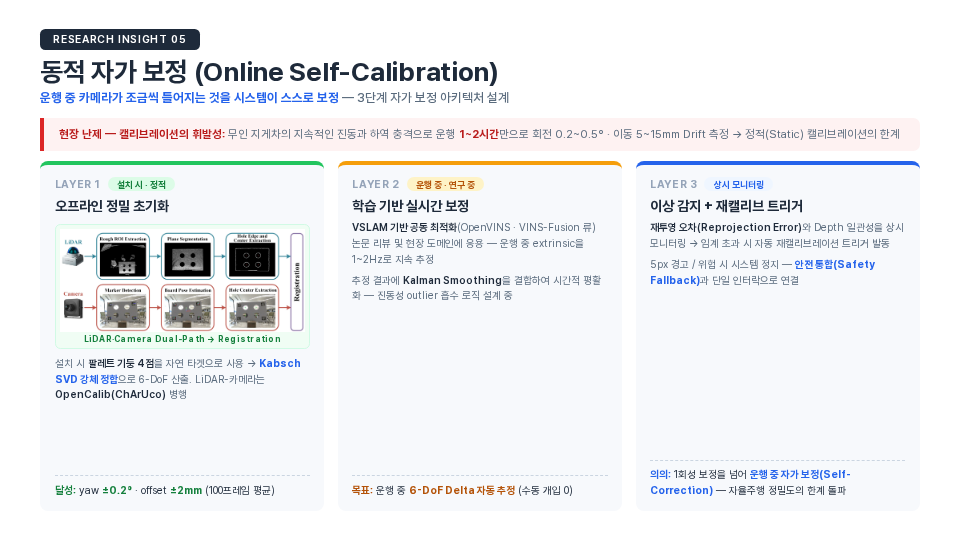{ width="100%" }
</figure>

## 15. VSLAM · LiDAR Keypoint 자가 보정 파이프라인

<figure markdown>
  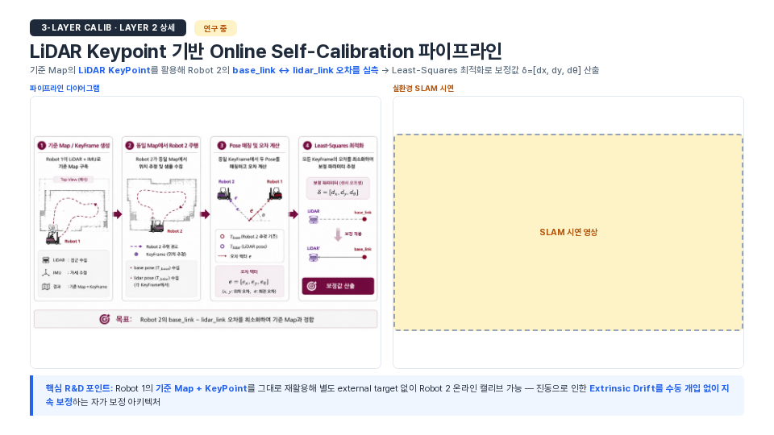{ width="100%" }
</figure>

## 16. Multi-Sensor Fusion 통합 R&D

<figure markdown>
  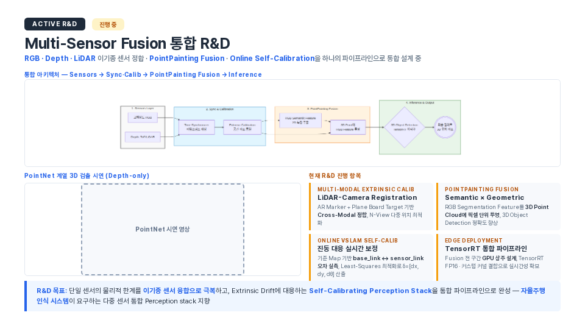{ width="100%" }
</figure>

## 17. Isaac Sim 기반 Sim-to-Real R&D 로드맵

<figure markdown>
  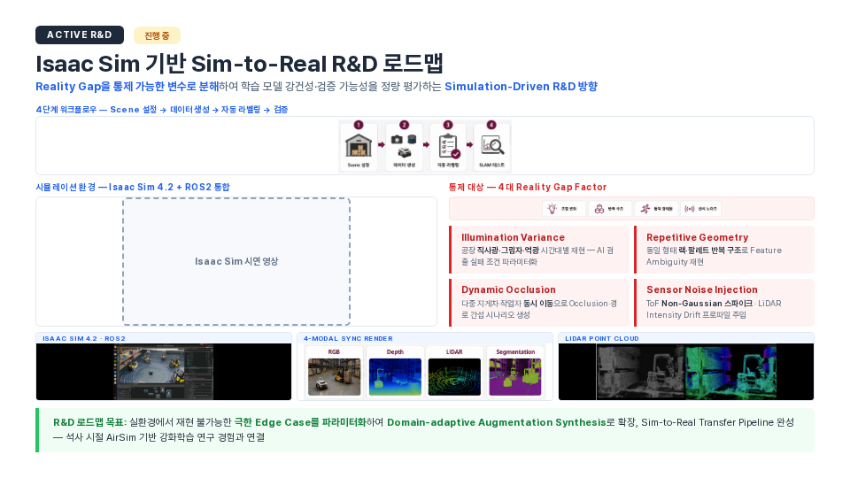{ width="100%" }
</figure>

## 18. Outro · Vision

<figure markdown>
  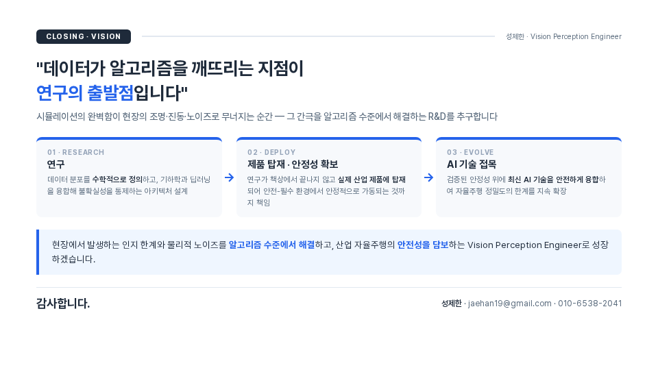{ width="100%" }
</figure>
