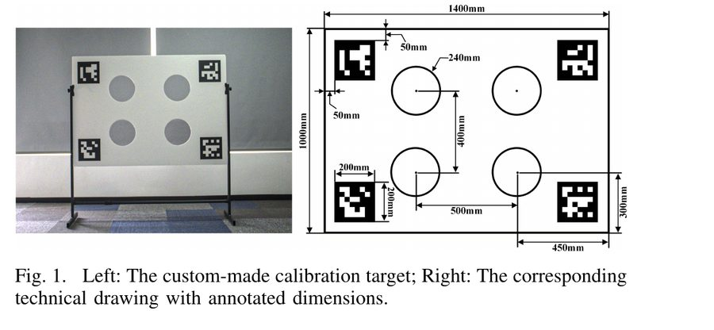
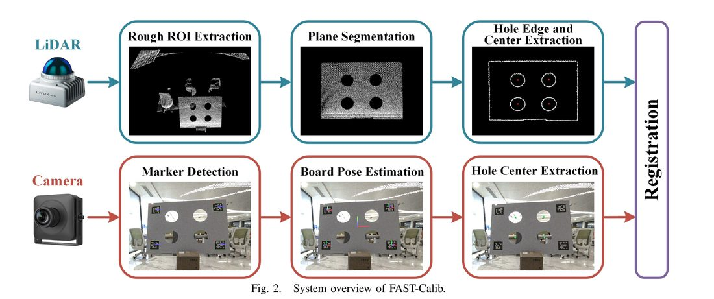
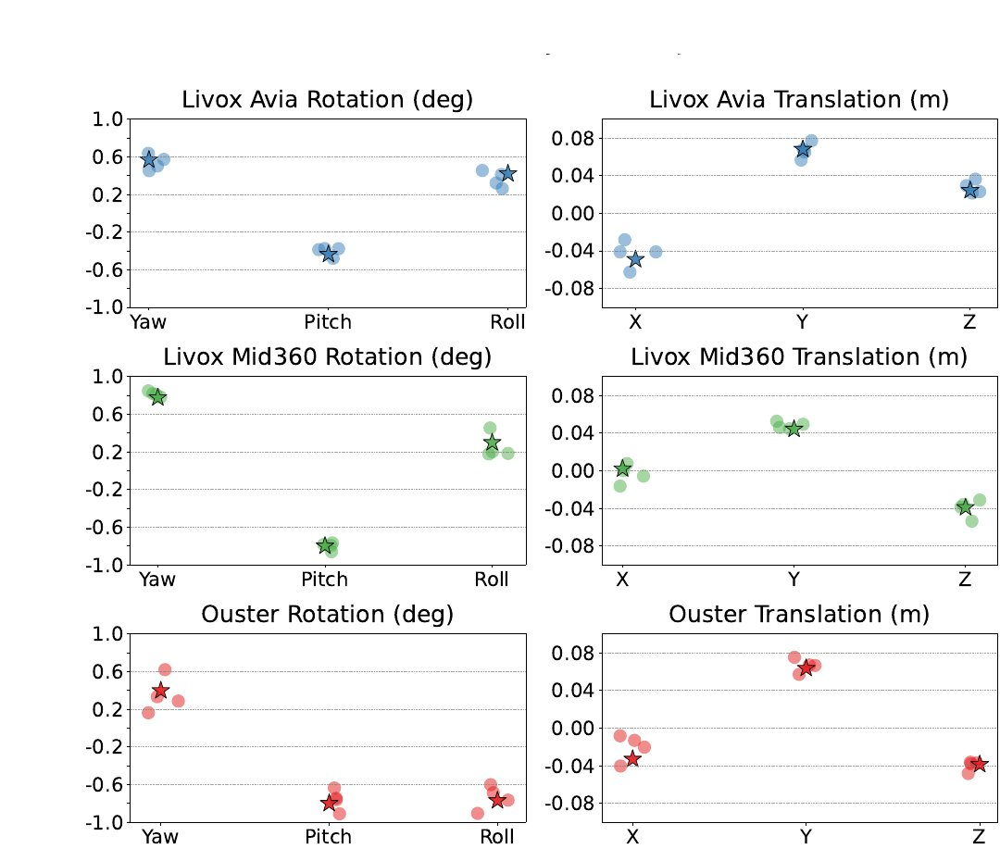
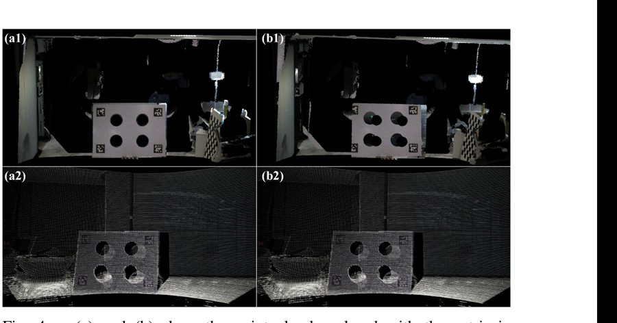

# FAST-Calib: LiDAR-Camera Extrinsic Calibration in One Second

!!! note "논문 정보"
    Chunran Zheng, Fu Zhang, *"FAST-Calib: LiDAR-Camera Extrinsic Calibration
    in One Second,"* arXiv:2507.17210, 2025.
    [arXiv 링크](https://arxiv.org/abs/2507.17210)

## 이 논문을 읽은 이유

LiDAR/ToF depth 센서와 RGB 카메라 간 외부 캘리브레이션(extrinsic calibration)
파이프라인을 직접 구현하는 과정에서, 캘리브레이션 타겟을 어떻게 설계해야
카메라와 depth 센서 양쪽에서 동시에 안정적으로 검출되는지가 핵심 병목이었다.
인쇄된 체커보드 패턴만으로는 depth 센서 쪽(특히 ToF의 amplitude 채널)에서
충분한 대비를 확보하지 못하는 경우를 실제로 겪었고, 이 문제를 해결하는 타겟
설계 사례를 찾다가 FAST-Calib을 접했다. 이 리뷰는 논문의 방법론을 정리하고,
실제 진행 중인 캘리브레이션 보드 설계에 어떻게 반영했는지를 함께 기록한다.

## 문제 정의: 왜 캘리브레이션 타겟 설계가 어려운가

LiDAR-카메라 외부 캘리브레이션은 자율주행/로보틱스 센서 퓨전의 전제조건이다.
논문은 기존 타겟 기반 방법들의 한계를 다섯 가지로 정리한다.

1. **호환성 제한** — 대부분의 도구가 기계식(mechanical) 또는 솔리드스테이트
   (solid-state) LiDAR 중 한쪽 스캔 패턴에만 맞춰져 있다.
2. **낮은 자동화** — 공장 환경에서는 타겟 위치가 고정돼 있지만, 실험실
   환경에서는 임의 배치된 타겟에서 수동으로 관심 영역(ROI)을 잘라내야 한다.
3. **다중 씬 미지원** — 좁은 실험실에서는 타겟 하나만 놓을 수 있어 여러 번
   촬영하고 합동 최적화(joint optimization)해야 하는데, 이 워크플로우를
   지원하는 도구가 드물다.
4. **낮은 효율** — 여러 처리 단계를 거치느라 초 단위 캘리브레이션이 불가능하다.
5. **에지 팽창(Edge Dilation) 문제** — Livox 같은 대형 스팟 크기의 LiDAR는
   빔이 타겟 가장자리에서 실제보다 넓게 퍼져 찍히는데(spot spread), 이걸
   보정하지 않으면 구멍 중심 추정이 체계적으로 틀어진다.

## 제안 방법

### 타겟 설계

<figure markdown>
  
  <figcaption>커스텀 3D 타겟(왼쪽)과 치수가 명시된 도면(오른쪽). 체커보드 +
  ArUco 마커(카메라 검출용)와 4개의 원형 구멍(LiDAR 검출용)을 한 판에
  결합했다. Fig. 1, FAST-Calib.</figcaption>
</figure>

핵심 아이디어는 카메라와 LiDAR가 **서로 다른 물리 신호로 같은 타겟을
독립적으로 검출**하게 만드는 것이다. 카메라는 인쇄된 체커보드/마커의 광학적
대비로 코너를 잡고, LiDAR는 판에 실제로 뚫린 원형 구멍의 깊이 불연속(구멍
안쪽은 반사가 없거나 배경까지의 거리가 다르게 찍힘)으로 구멍 중심을 잡는다.
두 센서가 애초에 다른 신호를 보므로, 한쪽 신호가 약해도(예: 낮은 인쇄 대비)
다른 쪽 검출에는 영향을 주지 않는다.

### 시스템 파이프라인

<figure markdown>
  
  <figcaption>LiDAR 브랜치(거친 ROI 추출 → 평면 분할 → 구멍 엣지/중심 추출)와
  카메라 브랜치(마커 검출 → 보드 포즈 추정 → 구멍 중심 추출)가 독립적으로
  처리되다가 Registration 단계에서 결합된다. Fig. 2, FAST-Calib.</figcaption>
</figure>

**LiDAR 브랜치**는 우선 대략적인 ROI를 잘라내고, 평면 분할로 타겟 판 자체를
분리한 뒤, 구멍 가장자리 점들을 유클리드 거리 기반으로 클러스터링한다. 이때
논문의 핵심 기여 중 하나인 **타원 피팅 기반 에지 팽창 보정**이 들어간다 —
각 클러스터에 일반 원뿔(conic) 형태

$$Ax^2+Bxy+Cy^2+Dx+Ey+F=0$$

을 최소제곱으로 피팅하고, 판별식 $B^2-4AC<0$ 조건으로 타원인지 확인한 뒤,
피팅된 타원의 반장축이 실제 구멍 반지름과 4cm 이내로 일치하고 이심률이
충분히 낮은(원에 가까운) 경우만 유효한 구멍으로 채택한다. 스팟 크기 때문에
팽창된 엣지 점들도 타원 방정식으로 fitting하면 참 중심으로 수렴하는 원리를
이용한 것이다.

**카메라 브랜치**는 ArUco 마커로 보드 포즈를 추정한 뒤, 알려진 기하(구멍
위치)로부터 이미지 상의 구멍 중심을 역산한다.

**Registration**은 두 브랜치에서 나온 대응하는 구멍 중심점 쌍 $N$개(멀티씬
합동 캘리브레이션 시 각 씬이 4개씩 기여)에 대해, 강체 변환

$$\min_{\mathbf{T}_{CL}} \frac{1}{4N}\sum_{i=1}^{4N}\left\|\mathbf{p}_i^C - \mathbf{T}_{CL}\mathbf{p}_i^L\right\|^2$$

를 최소화하는 폐형해(closed-form solution)를 Kabsch 방법(SVD 기반)으로 구한다
— 점 대응이 이미 알려져 있으니 반복 최적화 없이 한 번에 풀린다는 게 "1초"
타이틀의 근거다.

## 실험 결과

세 가지 LiDAR(OS1-128, Livox Avia, Mid360)와 광각 카메라 조합에서 검증했다.

**정합 오차** — 논문 표에 따르면 point-to-point 등록 잔차가 모든 조합에서
지속적으로 6.5mm 이내. 특히 Mid360처럼 레이저가 성기고 불규칙하게 분포된
솔리드스테이트 LiDAR에서는 비교 대상인 Velo2Cam이 5회 실험 전부 실패한 반면,
FAST-Calib은 안정적으로 수렴했다.

<figure markdown>
  
  <figcaption>세 데이터 쌍 조합으로 각각 독립 캘리브레이션한 결과(점)와 전체
  4쌍 합동 최적화 결과(별)의 분포. 세 센서 모두 6자유도 전반에서 점들이
  좁게 모여 있어, 데이터 조합이 달라져도 결과가 크게 흔들리지 않음을 보여준다.
  Fig. 3, FAST-Calib.</figcaption>
</figure>

**정성적 정합 결과** — 색상을 입힌 포인트클라우드를 이미지에 겹쳤을 때 타겟
경계에 얼마나 깔끔하게 붙는지로도 확인했다.

<figure markdown>
  
  <figcaption>Avia LiDAR(위)와 Ouster LiDAR(아래)에서 추정한 외파라미터로
  포인트클라우드를 색칠한 결과. 타겟 판의 경계와 구멍 윤곽이 이미지 상의 실제
  경계와 정확히 겹친다. Fig. 4, FAST-Calib.</figcaption>
</figure>

**처리 속도** — 밀집 포인트클라우드를 직접 다루지 않고 8mm 해상도로
다운샘플링한 뒤 2D 평면에서 엣지 추출을 수행해 연산량을 줄였고, 여러 데이터
쌍도 병렬 처리한다. 그 결과 센서 구성 전체에서 총 처리 시간이 0.7초 이내였다
(LiDAR 처리가 대부분을 차지하고, 정합 자체는 마이크로초 단위 — 폐형해라
반복이 없기 때문).

## 실제 캘리브레이션 보드 설계에 적용한 부분과 차이점

진행 중인 depth-RGB 외부 캘리브레이션 작업에서, 캘리브레이션 보드를
FAST-Calib과 같은 "체커보드/마커 + 구멍" 조합으로 설계했다 — 산업용 ToF
depth 센서가 인쇄 패턴만으로는 충분한 대비를 확보하지 못하는 문제를 같은
방식으로 우회하기 위해서다.

다만 **구멍 형태는 원형이 아니라 사각형**으로 바꿨다. 이는 단순한 취향
차이가 아니라 실제 제약에서 나온 선택이다:

- FAST-Calib의 타원 피팅은 원형 구멍이 임의의 시야각에서도 항상 타원으로
  투영된다는 성질(원뿔 곡선의 사영 불변성)을 이용한 것으로, 사각형 구멍에는
  같은 수학이 그대로 적용되지 않는다 — 사각형은 시야각에 따라 일반적인
  사각형(quadrilateral)으로 투영되므로 별도의 코너 기반 피팅이 필요하다.
- 반대로 사각 구멍은 실물 제작(레이저 커팅/CNC) 편의성과, 보드 본체의
  체커보드 격자와 시각적으로 정렬하기 쉽다는 장점이 있다 — 원형 홀 가공보다
  격자 눈금에 맞춰 사각형을 뚫는 쪽이 판 제작 단계에서 치수 오차 관리가
  쉬웠다.
- 대신 depth 처리 파이프라인에서는 구멍 검출을 타원 피팅이 아니라, 평면
  RANSAC으로 보드 평면을 먼저 분리한 뒤 `cv2.minAreaRect` 기반으로 사각형
  윤곽을 직접 피팅하는 방식으로 구현했다.

또한 FAST-Calib은 라이다-카메라(양쪽 다 3D 관측이 가능한 LiDAR 기준)
조합이지만, 이번 파이프라인은 한쪽이 RGB 카메라뿐인 depth-RGB 조합이라
정합 방식 자체(3D-3D 강체정합 vs 3D-2D PnP)가 다르다 — 이 부분은 논문의
Registration 단계를 그대로 가져다 쓸 수 없어 별도로 다중 포즈 PnP 기반
파이프라인을 구현했다(추후 별도 포스트에서 다룰 예정).

## 짧은 평가

이 논문의 강점은 "정확도"보다 **"실험실/실제 배포 환경 양쪽에서 재현
가능하게 만들었다"**는 실용성에 있다고 본다 — 다중 씬 합동 최적화를 표준
워크플로우로 넣어서 좁은 공간에서도 타겟을 여러 번 움직여 정확도를 확보할
수 있게 했고, 처리 시간을 초 단위로 낮춰서 생산 라인 적용까지 노렸다는 점이
실제로 이 타겟 설계를 우리 프로젝트에 가져다 쓰는 데 결정적이었다. 다만
논문의 정량 비교가 전부 저자 자신의 3개 LiDAR 조합에 한정돼 있어, RGB-D
카메라처럼 애초에 3D 관측이 아닌 depth 센서 조합에서도 같은 수준의 강건성이
나올지는 별도로 검증이 필요하다는 게 이번 리뷰에서 남는 질문이다.
