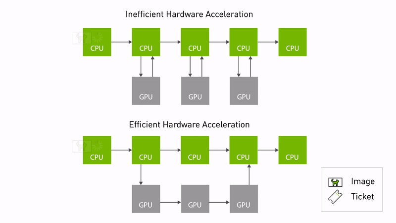
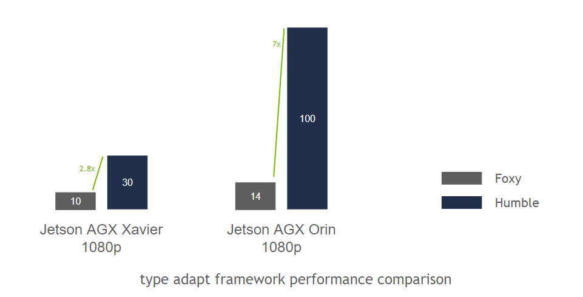

# NVIDIA Isaac ROS NITROS: 득실과 실제 제약 정리

!!! note "참고 자료"
    본 글은 NVIDIA Isaac ROS 공식 문서([NITROS 개념 문서](https://nvidia-isaac-ros.github.io/concepts/nitros/index.html),
    [FAQ](https://nvidia-isaac-ros.github.io/faq/index.html)), [NVIDIA 기술 블로그](https://developer.nvidia.com/blog/improve-perception-performance-for-ros-2-applications-with-nvidia-isaac-transport-for-ros/),
    [Isaac ROS GitHub 이슈](https://github.com/NVIDIA-ISAAC-ROS/isaac_ros_nitros/issues)와
    [개발자 포럼](https://forums.developer.nvidia.com/c/agx-autonomous-machines/isaac/isaac-ros/600)의
    공개 게시물을 바탕으로 정리했다.

## 왜 조사했는가

GPU에서 이미지/포인트클라우드를 가공한 뒤 ROS2 토픽으로 내보내는 파이프라인을
설계하다 보면, GPU 메모리에서 CPU 메모리로 복사한 뒤 DDS로 직렬화해서 보내고
받는 쪽에서 다시 GPU로 올리는 왕복 비용이 눈에 밟힌다. "그럼 아예 GPU
메모리에 상주한 채로 노드 간에 주고받으면 되지 않나"라는 질문에 대한
NVIDIA의 답이 NITROS다. 실제로 이 조사는 진행 중인 depth-RGB 정합 모듈의
연산 백엔드를 CPU/GPU 중 무엇으로 할지 검토하다가 나온 것이다 — 다만
결론부터 말하면, **"쓸 수 있다"와 "지금 쓰는 게 합리적이다"는 다른 문제**였다.

## NITROS가 하는 일

NITROS(NVIDIA Isaac Transport for ROS)는 두 가지 메커니즘의 조합이다.

- **타입 적응(Type Adaptation, REP-2007)**: ROS 노드가 표준 메시지 타입 대신
  하드웨어 가속기에 최적화된 포맷으로 데이터를 주고받을 수 있게 한다. 이
  적응된 타입을 쓰면 CPU와 가속기(GPU) 메모리 사이의 복사를 없앨 수 있다.
- **타입 협상(Type Negotiation, REP-2009)**: 그래프 안의 노드들이 런타임에
  서로 지원하는 데이터 포맷을 알리고, ROS 프레임워크가 그중 최적의 조합을
  골라준다. 기존(비-NITROS) 노드와도 호환은 유지된다.

두 NITROS 노드가 그래프에서 인접해 있으면 서로를 발견해서 타입 적응으로
데이터를 공유한다 — 이게 "zero-copy" 전송이다.

<figure markdown>
  
  <figcaption>위: 매 노드가 CPU로 이미지를 돌려받아 처리한 뒤 다시 GPU로 넘기는
  구조 — 노드마다 CPU↔GPU 왕복이 반복된다. 아래: 이미지 자체는 GPU에 그대로
  두고, 각 노드는 "티켓"(포인터/핸들)만 주고받는 구조 — NITROS의 타입
  적응/협상이 만드는 게 이쪽. NVIDIA Isaac ROS 공식 문서 및
  <a href="https://developer.nvidia.com/blog/improve-perception-performance-for-ros-2-applications-with-nvidia-isaac-transport-for-ros/">NVIDIA
  기술 블로그</a>에서 인용.</figcaption>
</figure>

## 실제로 얻는 이득

NVIDIA 자체 벤치마크에 따르면, **최소한의 연산만 하는 노드로 구성된
그래프**(프레임워크 자체의 오버헤드만 측정하기 위한 설계) 기준으로 ROS 2
Foxy 대비 타입 적응/협상을 켰을 때 **Xavier에서 3배, Orin에서 7배** 개선을
보고했다.

<figure markdown>
  
  <figcaption>1080p 기준 Jetson AGX Xavier(2.8배)와 Jetson AGX Orin(7배)에서
  ROS 2 Foxy 대비 타입 적응 프레임워크(Humble)의 처리량 비교. 출처:
  <a href="https://developer.nvidia.com/blog/improve-perception-performance-for-ros-2-applications-with-nvidia-isaac-transport-for-ros/">NVIDIA
  기술 블로그</a>.</figcaption>
</figure>

이 수치를 읽을 때 주의할 점이 하나 있다 — 이건 **"프레임워크(전송) 오버헤드
자체"를 고립시켜 측정한 값**이지, 실제 애플리케이션(연산이 실제로 무거운
파이프라인) 전체의 속도 향상 배수가 아니다. 전체 파이프라인에서 전송 비용이
차지하는 비중이 작다면(연산 자체가 무거운 경우), 체감 개선폭은 이보다 훨씬
작아진다. NVIDIA가 공개한 예시 파이프라인은 AprilTag 검출, 스테레오
디스패리티(스테레오 카메라 → 정류 → DNN 추론 → 포인트클라우드), 이미지
세그멘테이션 세 가지다.

## 문제점과 실제 제약

여기가 가장 중요한 부분이다. 공식 문서와 실제 이슈 트래커를 같이 보면,
"zero-copy를 그냥 켜기만 하면 되는" 기능이 아니라는 게 드러난다.

### 1. Zero-copy는 "같은 프로세스"일 때만 성립한다

공식 문서에 명시된 조건이다: **"NITROS의 zero-copy 이득을 보려면 가속된
노드들이 전부 같은 프로세스에서 실행돼야 한다."** 즉 [ROS2
컴포지션](https://docs.ros.org/en/humble/Concepts/Intermediate/About-Composition.html)
(component container에 여러 노드를 로드해서 한 프로세스로 묶는 방식)이
전제다. 각자 별도 프로세스로 `ros2 run`한 노드 두 개는 NITROS를 쓰더라도
zero-copy가 안 된다 — 이건 아키텍처를 처음부터 컴포지션 가능한 형태로
설계해야 한다는 뜻이라, 기존에 독립 프로세스로 짜여 있던 노드들을 옮기려면
실제로 재구조화가 필요하다. 컴포지션이 정확히 뭘 하는지, zero-copy의
내부 동작 원리와 그 자체의 트레이드오프(특히 장애 격리를 잃는다는 점)는
별도로 조사해서 [ROS2 노드 컴포지션 리뷰](ros2-composition.md)에 정리했다.

추가로 **토픽 하나당 협상하는(negotiating) 퍼블리셔가 1개만 허용**된다는
제약도 있다 — 같은 토픽에 여러 발행자를 두는 흔한 패턴(예: 디버그용 리플레이
발행자를 따로 두는 것)이 NITROS 협상 경로에서는 그대로 못 쓰인다.

### 2. 버전이 장비 전체에 고정된다

Isaac ROS는 특정 JetPack/CUDA/TensorRT/ROS2 조합에 강하게 묶여 있다.
예를 들어 release-3.2는 JetPack 6.1과 Docker Engine 27.2.0 이상을 요구하고,
이전 버전(JetPack 5.1.2, Ubuntu 20.04, Jetson Xavier)에 대한 지원은 이미
제거됐다. 이건 **NITROS를 쓰는 노드 하나만의 문제가 아니라, 같은 장비에서
돌아가는 다른 소프트웨어(SLAM 등) 전부가 그 버전 조합 안에서 움직여야
한다는 뜻**이다 — 부분 채택이 기술적으로는 가능해도(비-NITROS 노드와
호환은 유지됨), 장비 전체의 OS/드라이버/런타임 버전 고정이라는 비용은
그대로 남는다.

### 3. 실제로 보고된 문제들

- **빌드/의존성**: `magic_enum.hpp`, `nvToolsExt.h` 등 헤더를 못 찾는 빌드
  실패가 [보고](https://forums.developer.nvidia.com/t/issues-with-building-isaac-ros-nitros-and-related-packages-due-to-magic-enum-dependency/323262)됐다.
- **컴포지션 시 QoS 충돌**: 같은 컨테이너에 카메라 드라이버와 함께 노드를
  올리고 intra-process 통신을 켜면 "intraprocess communication allowed
  only with volatile durability"라는 예외가 발생하는 사례가
  [보고](https://github.com/NVIDIA-ISAAC-ROS/isaac_ros_visual_slam/issues/141)됐다
  — ROS2의 intra-process 통신 자체가 QoS durability를 VOLATILE로 강제하는데,
  다른 이유로 TRANSIENT_LOCAL 같은 durability가 필요한 토픽이 섞여 있으면
  컴포지션이 깨진다는 뜻이다.
- **타입 연결 난이도**: 기존 ROS2 노드에 NITROS 타입(TensorList 등)을
  가져다 쓰려는 개발자들이 라이브러리 링킹 단계에서 막히는 사례가 여럿
  보고됐다 — 진입장벽이 "몇 줄 추가"보다는 크다는 정황.

## 득실 정리

| | 얻는 것 | 잃는 것 |
|---|---|---|
| 성능 | 전송 오버헤드 자체는 최대 수 배 개선(프레임워크 기준) | 컴포지션 전제라 기존 프로세스 구조 재설계 필요 |
| 상호운용성 | 비-NITROS 노드와 호환 유지(표준 인터페이스) | zero-copy 자체는 NITROS-NITROS 쌍에서만, 그것도 같은 프로세스 한정 |
| 유지보수 | NVIDIA가 관리하는 가속 구현을 그대로 사용 | JetPack/CUDA/TensorRT/ROS2 버전이 장비 전체에 고정, 다른 노드도 그 제약을 같이 받음 |
| 개발 경험 | 공식 문서/예제 파이프라인 제공 | 빌드 의존성, 컴포지션-QoS 충돌 등 실제 이슈가 다수 보고됨 |

## 그래서 언제 쓸 가치가 있는가

이 조사에서 얻은 실질적인 결론은, NITROS 채택 여부를 "GPU 가속이 필요한가"가
아니라 **"GPU 연산 자체가 느린가, 아니면 GPU↔CPU 복사가 느린가"**로 나눠서
판단해야 한다는 것이다.

- 연산(추론, 렌더링 등) 자체가 병목이라면 CuPy/PyTorch 같은 GPU 연산
  라이브러리로 옮기는 것만으로 대부분 해결된다 — 이건 일반 Python 의존성
  추가 수준이라 장비 전체 버전 고정 같은 부담이 없다.
- **오직 "연산은 이미 충분히 빠른데, 프로세스 간 GPU↔CPU 복사 자체가 실측
  병목으로 확인된" 경우에만** NITROS/컴포지션으로 넘어갈 근거가 생긴다 —
  그것도 컴포지션 가능한 아키텍처로의 재설계 비용과, 장비 전체 버전 고정
  비용을 감수할 가치가 있는지 별도로 따져야 한다.

즉 NITROS는 "GPU를 쓰는 방법"이 아니라 "이미 GPU를 쓰고 있는데 노드 간
전송이 병목인 특정 상황을 위한 도구"에 더 가깝다. 이 구분을 안 하고
"GPU=NITROS"로 바로 가면, 정작 필요하지도 않은 시스템 전체 버전 고정
비용을 먼저 치르게 될 위험이 있다.
