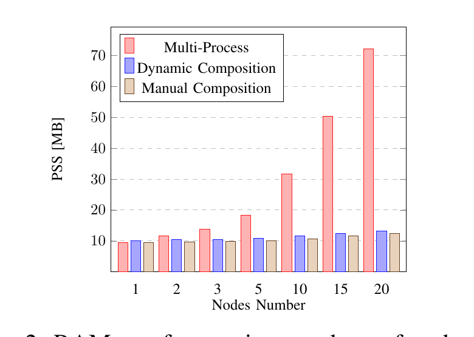
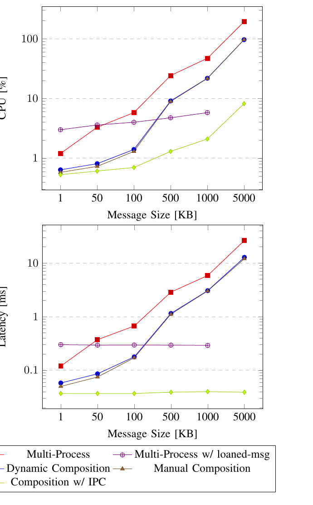

# ROS2 노드 컴포지션(Node Composition): 개념과 실제 성능 임팩트

!!! note "참고 자료"
    본 글은 ROS2 공식 문서([Composition 개념](https://docs.ros.org/en/humble/Concepts/Intermediate/About-Composition.html),
    [Intra-Process Communication 튜토리얼](https://docs.ros.org/en/humble/Tutorials/Demos/Intra-Process-Communication.html)),
    학술 논문(S. Macenski, A. Soragna, M. Carroll, Z. Ge, "Impact of ROS 2 Node
    Composition in Robotic Systems," [arXiv:2305.09933](https://arxiv.org/abs/2305.09933),
    2023), 그리고 [Isaac ROS GitHub 이슈](https://github.com/NVIDIA-ISAAC-ROS/isaac_ros_image_pipeline/issues/45)의
    공개 게시물을 바탕으로 정리했다.

## 왜 조사했는가

지난번 NITROS 조사에서 "zero-copy 이득을 보려면 가속된 노드들이 전부 같은
프로세스에서 실행돼야 한다"고 적었는데, 정작 "같은 프로세스에서 실행한다"는
게 ROS2에서 정확히 뭘 뜻하는지, 그게 왜 zero-copy의 전제조건인지는 제대로
파본 적이 없었다. 그 "같은 프로세스" 메커니즘의 정체가 바로 **컴포지션
(Composition)**이다. NITROS를 다시 평가하려면 이 개념부터 정확히 알아야
한다는 게 이번 조사의 동기다.

## Composition이 뭔가

ROS1에는 두 가지 코드 작성 방식이 있었다 — 독립 실행파일로 컴파일되는
**노드(Node)**와, 공유 라이브러리로 컴파일돼서 컨테이너 프로세스가 런타임에
불러오는 **노드릿(Nodelet)**. 문제는 두 방식의 API가 서로 달라서, 나중에
"이 노드를 다른 노드와 한 프로세스에 묶고 싶다"는 결정을 내리면 코드를
다시 써야 했다.

ROS2는 이 API를 통합했다. 이제 코드는 전부 **컴포넌트(Component)**로
작성하고, 그 컴포넌트를 독립 프로세스로 띄울지 여러 개를 한 프로세스에
묶어서 띄울지는 **배포 시점의 결정**으로 미룰 수 있다 — 코드를 고칠 필요가
없다:

> "By making the process layout a deploy-time decision the user can choose
> between running multiple nodes in separate processes with the benefits of
> process/fault isolation... and running multiple nodes in a single process
> with the lower overhead and optionally more efficient communication."
> — [ROS2 Composition 공식 문서](https://docs.ros.org/en/humble/Concepts/Intermediate/About-Composition.html)

컴포넌트를 조합하는 방법은 두 가지다:

- **수동(정적) 컴포지션**: 컴파일 타임에 어떤 컴포넌트들을 한 프로세스에
  묶을지 코드로 명시. 유연성은 제일 낮지만 스레드 우선순위 등을 세밀하게
  통제할 수 있어서, 리소스가 극도로 제한된 환경(임베디드)에 적합
- **동적(런타임) 컴포지션**: 컴포넌트를 공유 라이브러리로 빌드해두고,
  `component_container` 프로세스가 실행 중에 `ros2 component load` 서비스
  호출이나 launch 파일로 불러온다. 배포 후에도 어떤 컴포넌트를 어느
  프로세스에 둘지 바꿀 수 있어서 대부분의 경우 이쪽이 권장됨

컴포넌트 컨테이너는 내부적으로 3가지 executor 조합을 기본 제공한다:
단일 스레드 executor를 컴포넌트들이 공유(`component_container`), 멀티
스레드 executor를 공유(`component_container_mt`), 컴포넌트마다 독립 executor
(`component_container_isolated`). 어느 걸 쓰느냐에 따라 지연시간/CPU
프로파일이 상당히 달라진다(아래 실측 참고).

## Zero-copy IPC는 정확히 어떻게 동작하나

핵심은 `NodeOptions().use_intra_process_comms(true)`다. 이걸 켜고
`std::unique_ptr`로 발행/구독하면, 미들웨어(DDS)를 거치지 않고 **메시지의
포인터 자체가 구독자에게 그대로 넘어간다** — 직렬화/역직렬화, 복사가 전혀
없다. 공식 데모에서 발행 시점과 수신 시점에 메시지의 메모리 주소를 같이
찍어보면 완전히 동일한 주소가 나온다.

이때 두 가지 비직관적인 제약이 있다 (공식 튜토리얼에서 명시):

1. **1:N 팬아웃에서는 한 구독자만 원본을 받는다.** `unique_ptr`은 소유권이
   하나만 존재한다는 뜻이라, 구독자가 여럿이면 그중 딱 하나만 원본 포인터를
   받고 **나머지는 전부 복사본**을 받는다 — 그리고 어느 구독자가 원본을
   받을지는 정해져 있지 않다(단순히 마지막으로 전달되는 쪽). 두 개의 이미지
   뷰어를 붙인 공식 데모에서 실제로 이 현상이 재현된다.
2. **먼저 발행되면 유실될 수 있다.** intra-process 통신은 "latching" 같은
   기능이 없어서, 구독이 완전히 설정되기 전에 발행된 메시지는 그냥
   사라진다 — 레이스 컨디션이다. 데모에서도 "첫 번째 메시지는 보통
   유실된다"고 명시돼 있다.

또한 QoS 쪽 제약도 있다: intra-process 통신은 **VOLATILE durability만
허용**한다. `TRANSIENT_LOCAL`처럼 늦게 붙는 구독자에게 마지막 값을 재전송해주는
durability를 쓰는 토픽이 같은 컨테이너에 섞여 있으면 컴포넌트 생성 자체가
예외를 던지며 실패한다 — 실제로 Isaac ROS의 이미지 파이프라인 컴포지션에서
`"intraprocess communication allowed only with volatile durability"` 예외로
[보고된 사례](https://github.com/NVIDIA-ISAAC-ROS/isaac_ros_image_pipeline/issues/45)가
있다.

## 실측 데이터: 얼마나 차이 나나

Macenski 등의 논문이 Raspberry Pi 4(ARM, 임베디드 로봇 대표 사양)와 x86에서
멀티프로세스 vs 정적/동적 컴포지션을 정량 비교했다.

<figure markdown>
  
  <figcaption>빈 노드 개수를 1~20개로 늘려가며 측정한 PSS(실제 물리 메모리)
  — 멀티프로세스(빨강)는 노드가 늘수록 가파르게 증가(20개에서 ~72MB)하는
  반면 동적/정적 컴포지션(파랑/베이지)은 거의 평평하다(20개에서 ~13MB).
  Fig. 2, Macenski et al. 2023.</figcaption>
</figure>

원인은 ROS2 프로세스마다 독립적인 DDS 네트워크 참가자를 만드는데, discovery
과정에서 이게 **O(N²)**로 자원을 잡아먹기 때문이다(2번째 프로세스 추가 시
+2.1MB, 20번째에는 +4.3MB) — 논문 표현으로는 "20노드 컴포지션 시스템이
2노드 멀티프로세스 시스템과 거의 같은 메모리를 쓴다."

<figure markdown>
  
  <figcaption>발행자 1개-구독자 1개 기준, 메시지 크기를 1KB~5MB로 늘리며
  측정. 멀티프로세스(빨강)는 메시지가 커질수록 CPU/레이턴시가 급격히
  나빠지는데, zero-copy IPC를 쓴 컴포지션(연두)만 거의 평평하게 유지된다.
  Fig. 3, Macenski et al. 2023.</figcaption>
</figure>

구체적 수치:

- 멀티프로세스는 1MB 넘는 메시지에서 **레이턴시가 발행 주기의 30%를
  초과** — 실시간성이 중요한 지표인데 여기서 무너짐
- 동적 컴포지션 + IPC는 메시지 크기와 무관하게 **레이턴시가 항상 ~40μs로
  일정** — 모놀리식(단일 프로그램) 수준
- **"loaned messages"**(멀티프로세스에서 zero-copy를 흉내내려는 별도
  최적화)는 2MB 넘는 메시지에서 **반복적으로 크래시**했고, 500Hz 넘는
  발행 빈도에서 데드락이 발생해 450Hz로 상한을 걸어야 했다 — "as of today,
  the risk of stability issues"라고 논문이 직접 경고함
- 실제 시스템 벤치마크: Nav2(15노드)를 ARM에서 컴포지션했더니 **CPU
  28%, RAM 33% 절감**(x86에서는 CPU 25%, RAM 44%). iRobot Create 3(RAM
  예산 60MB 미만인 임베디드 보드)는 논문 표현으로 **"컴포지션 없이는
  아예 불가능했을" 제품** — 멀티프로세스로 구성했다면 이 로봇에 실제로
  탑재된 것보다 훨씬 큰 메모리가 필요했을 것으로 추정됨

## 문제점과 실제 제약

**1. Fault isolation(장애 격리)을 잃는다.** 이게 가장 근본적인 트레이드오프다
— 논문도 이렇게 정리한다:

> "For systems under development, components are often placed in separate
> processes so that failures do not disturb the larger system... As programs
> become more mature, they may be grouped into processes to reduce latency
> or share resources."

한 프로세스에 여러 컴포넌트를 묶으면, 컴포넌트 하나가 크래시할 때 **같은
프로세스의 나머지 컴포넌트도 전부 같이 죽는다.** 개발 중에는 프로세스를
분리해서 디버깅을 쉽게 하고, 시스템이 안정화된 뒤에 묶는 게 논문이 제안하는
실무 순서다.

**2. QoS durability 제약** — 위에서 설명한 대로 VOLATILE만 허용되고,
`TRANSIENT_LOCAL`이 필요한 토픽이 섞이면 컴포넌트 생성이 실패한다.

**3. Executor 선택에 따라 성능이 크게 갈린다.** 논문의 별도 실험(구독마다
500μs 작업 부하를 줌)에서: 단일 스레드 executor는 CPU는 제일 적게 쓰지만
병렬 처리가 안 돼서 레이턴시가 제일 나쁘다. Isolated 컨테이너(컴포넌트마다
독립 executor)는 구독 개수가 코어 수를 넘어서면 유리해지고, ROS2 타이머를
쓰는 노드에서 특히 유리하다(타이머는 매 executor 반복마다 체크해야 하는데,
독립 executor면 그 오버헤드가 자기 컴포넌트에만 적용됨). "어느 게 항상
좋다"가 아니라 **워크로드에 따라 선택해야 하는 문제**.

**4. loaned messages는 아직 실무에 못 쓸 수준.** 위에서 언급한 대로 큰
메시지에서 반복 크래시, 높은 빈도에서 데드락 — 멀티프로세스에서 zero-copy를
흉내내고 싶어도 이 경로는 논문 작성 시점 기준 안정성 문제가 있다.

## 득실 정리

| | 얻는 것 | 잃는 것 |
|---|---|---|
| 메모리 | 노드 수가 늘어도 거의 평평(O(N²) discovery 비용 회피) | 없음 — 순수 이득 |
| CPU/레이턴시 | 큰 메시지에서 수십~수백 배 개선, IPC는 메시지 크기 무관 ~40μs 고정 | 없음(measured 상) |
| 장애 격리 | — | 컴포넌트 하나 크래시가 같은 프로세스 전체를 죽임 |
| QoS 유연성 | — | intra-process는 VOLATILE durability만 허용 |
| 개발 편의성 | 코드 변경 없이 배포 시점에 프로세스 레이아웃 결정 가능 | executor/컨테이너 선택에 성능이 크게 좌우돼 튜닝 필요 |

## NITROS와의 연결

이제 지난 글의 "NITROS의 zero-copy는 같은 프로세스여야만 작동한다"는
제약이 왜 있는지 설명된다 — NITROS의 타입 적응/협상도 결국 이 컴포지션의
intra-process 메커니즘(포인터 그대로 전달) 위에서 동작하기 때문에, 원천적으로
**같은 프로세스(같은 컴포넌트 컨테이너) 안에 있어야만** 성립하는 것이다.
그리고 이번 조사로 하나 더 명확해진 게 있다 — 컴포지션 자체가 공짜가
아니라 **장애 격리를 명시적으로 포기하는 선택**이라는 것. NITROS를
도입하려면 GPU↔CPU 복사 비용뿐 아니라, 그 전제조건인 컴포지션이 가져오는
"한 컴포넌트가 죽으면 전부 죽는다"는 위험까지 같이 감수하는 것임을
이제는 분명히 알고 판단할 수 있다.
